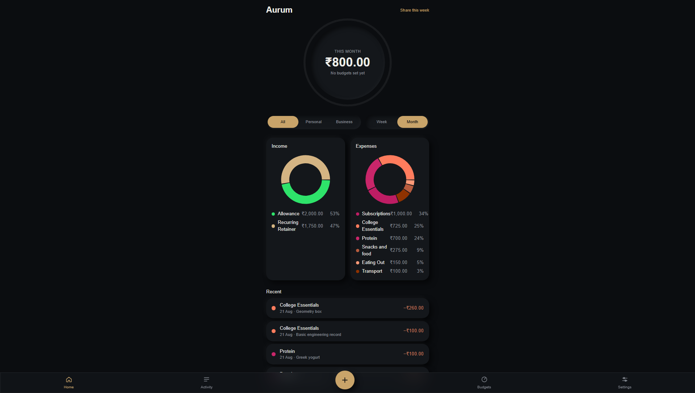
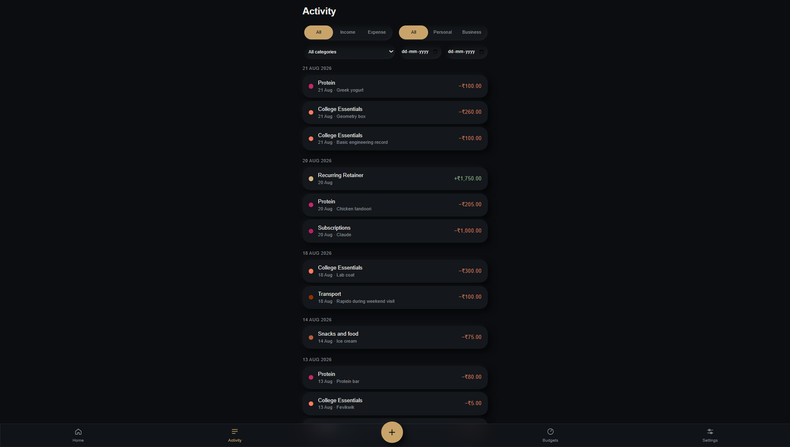
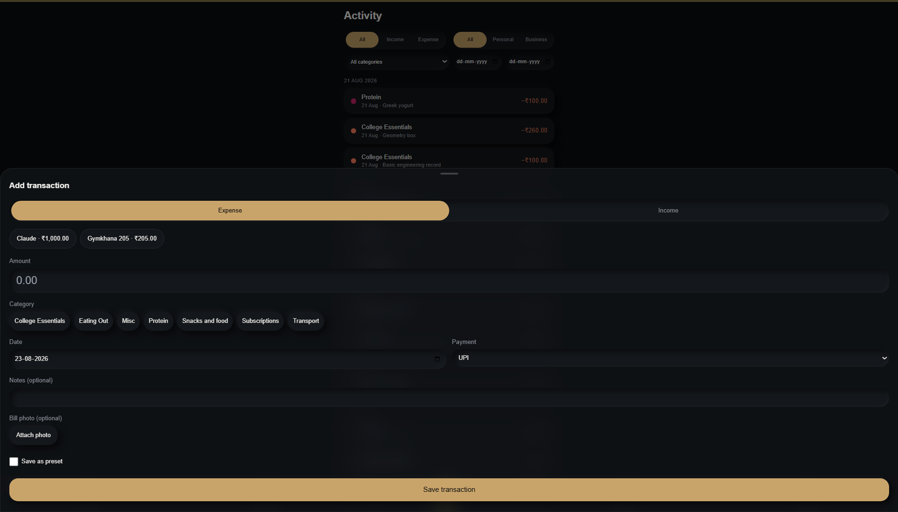
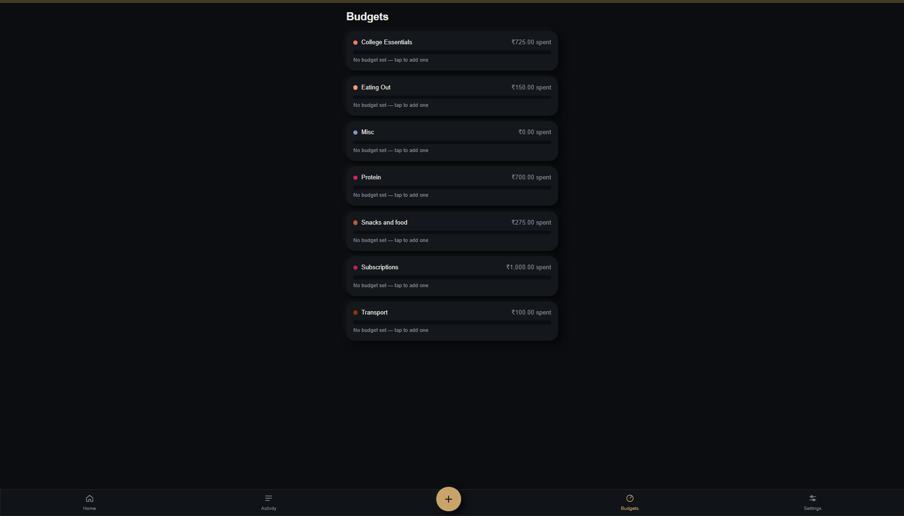
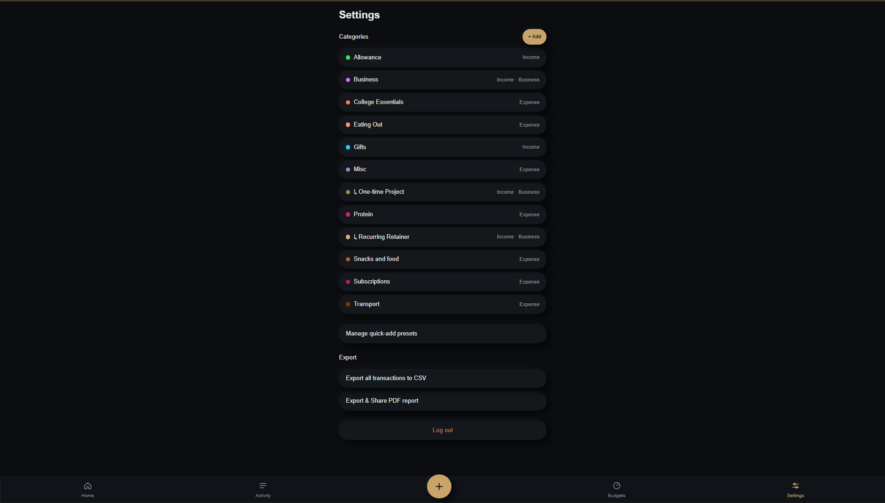

<div align="center">

# Meridian

**A personal day OS — six independent life-management apps living inside one shell, one login, and one design language.**

Money · Habits · Study · Timetable · Training · Notes

React + TypeScript · Vite · Tailwind · Supabase · Vercel · Installable PWA

</div>

---

> **Note on the repository name.** This repo started life as *Aurum*, a finance
> tracker. Aurum is still here — it is now one of six modules inside Meridian,
> the platform that grew around it. The directory name is the only thing that
> never caught up.

---

## Table of contents

- [What Meridian is](#what-meridian-is)
- [The six modules](#the-six-modules)
- [The design system](#the-design-system)
- [Onboarding](#onboarding-a-walkthrough-that-points-at-the-real-screen)
- [Technical architecture](#technical-architecture)
- [Notifications](#notifications--server-scheduled-not-client-timers)
- [Bring-your-own-Supabase](#bring-your-own-supabase)
- [Security posture](#security-posture)
- [Running it locally](#running-it-locally)
- [Project structure](#project-structure)
- [Screenshots and the live app](#screenshots-and-the-live-app)
- [Project status](#project-status)

---

## What Meridian is

A meridian is the line the rest of the map is measured from — noon, longitude,
where you are standing. Meridian the app is named for that idea: **one fixed
reference point that the whole of a day can be read against.**

Concretely, it is a single installable web app whose home screen is a launcher of
six tiles. Behind each tile is a genuinely separate application — its own data
model, its own navigation, its own colour palette, its own sense of what it is
for. What they share is the shell: one account, one session, one visual language,
one way in and one way out.

### Why one platform instead of six apps

Every one of these six started as something a real day actually needed — the
expense tracker first, then a habit grid, then a study timer, and so on. Built
separately, that is six sign-ins, six icons on a home screen, six sets of
settings, six places to check, and six chances to abandon one because opening it
was friction. Nobody maintains six apps about themselves.

Housed together, three things become possible that are not possible apart:

1. **One glance answers the day.** The launcher carries live summary cards —
   today's balance, this week's habits, study time logged, the next class — so
   the common case (*where do I stand?*) needs no app to be opened at all. The
   cards exist so you **don't** open the modules, not as a menu into them.
2. **One identity, one set of rules.** A single Supabase Auth session covers
   everything. Row Level Security is written once, the same way, for every table
   in every module. Notifications are one server, one schedule, one settings
   screen with per-module switches — not six notification stacks competing.
3. **One design decision, applied six times.** The exit gesture, the neumorphic
   material, the walkthrough, the empty states, the PIN pattern for editing the
   past — each was designed once and then re-tuned per module, which is how six
   apps end up feeling like one product rather than a folder.

The launcher is deliberately a **launcher first and a dashboard second**: the six
icons sit above the summary cards, because putting the cards on top would make a
dashboard that happens to contain a launcher, which is backwards.

---

## The six modules

Each module is a self-contained application under `src/<module>/` with its own
routes, hooks, lib and components. None of them import each other.

### Aurum — money

> *Latin for gold — the Au on every periodic table.*

A personal **and** business finance tracker, built for the messy reality of
student money: an allowance, freelance income, and daily spending, all needing to
stay separable without becoming two apps.

**Core interaction.** The screen is built around a **swipeable balance dial**.
Page one is this month's net, with a ring around it filling as you spend against
your budgets. Swipe sideways and the same dial becomes your all-time balance,
the ring now showing lifetime spend against lifetime income. Everything filters
by scope (All / Personal / Business) and period (Week / Month), with income and
expense breakdowns as donut charts underneath.

Logging is a bottom sheet designed for four seconds of attention: tap a
**quick-add preset** to prefill amount and category, or pick from a two-level
category tree, set date and payment mode, optionally attach a receipt photo
(compressed client-side before upload), and save. Anything you log repeatedly can
be saved *as* a preset from that same sheet, so the app gets faster the more you
use it.

**What makes it more than a generic expense app:**

- **Presets track their own usefulness.** Each records a use count and a
  last-used date, so the quick-add row reflects what you actually reach for
  rather than what you happened to create first.
- **Categories archive, they never delete.** Deleting one would silently rewrite
  history for every transaction under it. Archiving hides it from the pickers and
  leaves the ledger intact.
- **Reports are a real deliverable.** The PDF export takes a range, a type and a
  scope, embeds receipt photos inline, and hands the result to the OS share sheet
  on mobile (or downloads on desktop). A one-tap CSV export sits alongside it.
- **No notifications at all, on purpose.** Money is something you go and look at.
  An app that pushes your balance at you is an app that makes you anxious on its
  own schedule.

### Kindle — habits

> *To kindle is to get a flame going and then keep it going.*

A weekly habit grid: one row per habit, one cell per day.

**Core interaction.** The grid is the whole app. Each cell is coloured on a
generated gradient running muted red → orange → sage → green as the day's value
approaches that habit's target — so a bad week is legible as a *shape*, without
reading a single number. Below it, a row of pills logs today in one tap.

**What makes it more than a checkbox tracker:**

- **Habits are not all binary.** Some are done-or-not. Others are **staged** —
  study by the hour, water by the glass — so a partial day scores partially
  instead of counting as a failure. Holding a pill resets it to zero. Every habit
  derives its own gradient from its own stage count, but stage-max always lands
  on the exact same green, so "done" looks identical across every row.
- **Editing the past costs something.** Yesterday cannot be fixed from the grid.
  History sits behind a PIN and asks for a written reason before it accepts a
  change. That one piece of friction is what makes the grid an honest record
  rather than something you tidy up on Sunday.
- **It ships with three habits, and says so.** Gym, Sleep and Study exist only so
  a new grid has something in it — one all-or-nothing habit and two that count
  up, to demonstrate both kinds. The walkthrough calls them examples outright.

### Vigil — study

> *A vigil is a watch kept over time, deliberately, and held to the end.*

A daily study target with a countdown that survives the app being closed, and a
syllabus tree underneath it.

**Core interaction.** Tap once to start, once to pause, as many times as the day
needs. Time is reconstructed from timestamps rather than held in a JS interval,
so putting the phone in a pocket mid-session loses nothing.

**What makes it more than a Pomodoro clock:**

- **Overtime is bonus, not overflow.** The countdown reaches zero and keeps
  going. Anything past the target renders as bonus time on the week's chart
  rather than a bar that simply stops — the difference between an app that
  acknowledges a six-hour day and one that shrugs at it.
- **The topic tree rolls up by itself.** Categories hold subjects, subjects hold
  subtopics. You only ever tick a leaf; every parent above it is derived. There
  is no percentage to keep in sync, and no way for the tree to disagree with
  itself.
- **The target is yours, and it locks for the week.** Five hours is the default,
  not the rule — set anything from thirty minutes to twelve hours in Settings.
  The catch is deliberate: you choose it *once a week*, and it is then frozen
  until Monday. A target you can drag down at 9pm on a bad Thursday is not a
  target, it is a mood, and the week always ends "on target" because the target
  followed the week. The lock is enforced in Postgres rather than in the UI —
  `vigil_targets` is keyed on (user, week) and has a select policy and an insert
  policy and no update policy at all, so the row is immutable the moment it
  exists. Past weeks keep the target they were actually judged against, so
  lowering it now can never turn last month's misses into hits.
- **Its reminders read the clock and the total.** Vigil's notification copy is
  written in three bands — under 45 minutes, under 3½ hours, and the final
  stretch — with the real figures interpolated (*"2h 10m in, 2h 50m to go"*), and
  it goes **silent entirely** the moment the target is met. A study reminder that
  fires after you have already studied is how a person learns to ignore
  notifications.

### Loom — timetable

> *A loom is where separate threads are held in place long enough to become one cloth.*

A college timetable that opens instantly in a basement.

**Core interaction.** Built in three passes — a **term** (with period times you
define yourself; Loom never assumes your day is made of one-hour blocks), a
**library of classes** (name, room, faculty, colour), then the **week**, filled in
by tapping an empty slot and picking from the library. Week grid or single day.

**What makes it more than a static schedule:**

- **Offline-first for real, not cached.** Loom's source of truth is IndexedDB
  (Dexie) on the device; Supabase is a background mirror it pushes to when a
  connection exists. Together with a service-worker navigation fallback, the app
  *shell* and the data both load with no network at all. The other five modules
  read Supabase directly — Loom is the one that genuinely cannot afford to.
- **Timetables change mid-semester, and it plans for that.** Rather than
  overwriting the week, you add a **new version with an effective-from date**.
  Loom renders whichever version is in force today, and last month's timetable
  stays exactly as it was. Next semester can start as a copy of this one, so the
  class library and the period times carry over and only the grid is empty.
- **Classes are referenced, never copied.** Change a room in March and every
  Tuesday for the rest of term changes with it.
- **Saturday gets to be strange.** Copy any weekday into it as a starting point;
  what you get is a snapshot you can then edit freely, with no link back to the
  day it came from.

### Virtus — training

> *The Roman word for strength and valour — the composed kind, not the loud kind.*

A gym log with a deliberately unaggressive framing: marble, bronze, Cinzel
capitals. No flames, no shouting.

**Core interaction.** Setup is a chain of three, and the walkthrough is built
around it because missing it makes the app look broken: an **exercise library**
(sorted into muscle groups you name), **split days** assembled from that library
(Push, Pull, Legs — whatever yours are called), and a **weekly schedule** pointing
each weekday at a split day or at rest. After that Virtus opens already knowing
what today is, and logging is weight → reps → add.

**What makes it more than a set counter:**

- **Volume is coloured relative to your own rolling average.** Each session's
  volume — Σ(weight × reps) — is ranked against the mean of your **last six
  sessions of that same split day**, and the month grid shades the day
  accordingly. That comparison is the entire point: an all-time or cross-day
  average would rank a heavy shoulder session as a bad leg day. A session with no
  baseline yet renders as "logged, no baseline" rather than inventing a rank for
  it, and rest days sit off the scale entirely. Volume is always derived, never
  stored — a stored total is a second source of truth waiting to disagree.
- **Rest is a thing you log.** Marking a rest day records it as one, which keeps
  *"I rested"* and *"I forgot"* from looking identical a month later. That is the
  difference between a record and a guess.
- **Last session stays on screen while you lift.** What you did with this exact
  exercise last time sits directly above the inputs, and the inputs come
  pre-filled with those numbers. Beating it is changing one digit, not
  remembering anything.
- **Exercises are never truly removed.** Retiring one from the library keeps
  every set already logged under it.

### Chronicle — to-dos, notes, voice

> *A chronicle is a plain record of what happened, kept as it happens.*

Three sections over one shared tag vocabulary: **to-dos** (due dates, recurrence,
priorities), **notes** (a rich-text editor with headings, checklists and images),
and **voice memos**.

**Core interaction.** One capture button that knows where it is — in Voice it
starts recording immediately and transcribes afterwards; elsewhere it opens the
right composer. Any note or recording can be attached to a to-do as its reference
material. One search field reaches into titles, note bodies **and** transcript
text at once.

**What makes it more than a notes app:**

- **Voice memos transcribe themselves.** Audio goes to a private storage bucket;
  a Supabase Edge Function passes it to Groq's Whisper endpoint, and the
  transcript is written back and indexed by search. A recording whose tab was
  closed mid-transcription is flipped to `failed` after ten minutes and offers a
  retry rather than spinning forever.
- **Secret Notes have no button.** No lock icon, no menu entry. You type your
  Chronicle PIN into the search field and the section opens; leaving, navigating
  away, or backgrounding the app re-locks it, and the unlocked state is never
  persisted. Nothing in the product advertises that the section exists — the
  walkthrough does not mention it, and the notification dispatcher never queries
  it. *(It is honest about what it is: the PIN hides the section, RLS protects
  it. A closed door, not a safe.)*
- **Recurrence produces the next one and keeps the last one.** Ticking off a
  repeating to-do spawns the next occurrence while the completed instance stays
  in Completed, so the history of a weekly task is actually visible.

---

## The design system

The whole platform is **dark neumorphic** — surfaces lifted or pressed out of
their own background with paired shadows rather than outlined with borders. One
material, used consistently, so a component from Aurum dropped into Chronicle
would still look like it belonged to the same object.

**Every module has its own palette, and none of them are decoration.**

| Module | Ground | Accent | Reads as |
| --- | --- | --- | --- |
| **Meridian / Aurum** | near-black `#0B0D10` | brass `#C9A46A` | the shell itself |
| **Kindle** | deep indigo `#12142B` | lifted purple + sage green | evening, quiet |
| **Vigil** | warm cream `#E7DCC7` | gold and bronze on ink | daylight, paper, study |
| **Loom** | gunmetal `#1E2227` | gold + burgundy | institutional, timetable-ish |
| **Virtus** | marble `#F2EDE4` | bronze + ember, Cinzel capitals | classical, disciplined |
| **Chronicle** | charcoal `#1C1F21` | deep teal + gold on ivory, Spectral serif | a bound notebook |

Two of the six run on a **light** ground (Vigil, Virtus) and Chronicle on a dark
one of its own — so the neumorphic shadow pairs are re-derived per module rather
than reused, because black shadows on cream read as dirt.

Typography is layered the same way: **Space Grotesk** for display and the shell,
**Inter** for body, with **Cinzel** for Virtus's headings and **Spectral** for
Chronicle's.

### The sunset exit

Every screen inside a module has exactly one way out, top-right: a small sun over
a horizon line. Tapping it **sets the sun behind the horizon** and returns you to
the launcher — where the same horizon line closes the page. It replaces the back
button entirely, in all six modules, and it is the single gesture that makes
Meridian feel like one shell rather than six tabs. It takes its neumorphic
material and its accent from whichever module it is currently sitting in.

### Contrast is measured, not eyeballed

Colour choices here are backed by computed ratios recorded next to the tokens
themselves (`src/index.css`, `src/onboarding/tones.ts`). Several obvious-looking
pairings did not survive measurement and were changed: cream on Vigil's gold is
2.56:1 and unusable as a button, so the walkthrough's primary action uses Vigil's
own ink at 4.77:1 instead; Loom's muted grey sits at 4.32:1 on its card surface,
so body copy there uses the ink stepped back with opacity, which clears AA
everywhere. The same rule shaped the credits line at the bottom of the launcher:
it is quiet because it is small and grey, never because it was faded to 55%
opacity.

---

## Onboarding: a walkthrough that points at the real screen

Every module introduces itself the first time you open it, and Meridian
introduces itself on the launcher.

These are **not slideshows.** The walkthrough is a spotlight cut out of a scrim
over the live UI — one SVG mask, animating as a single shape from one target to
the next — so the sentence and the thing it describes are in the same glance. The
overlay swallows taps: the cutout is visible but inert, because letting someone
interact mid-tour reliably loses them inside a modal with a tour still running
behind it.

Details that matter:

- **The card wears the module's own material.** Same component, different tokens
  per module — which is what stops it reading as a third-party onboarding library
  dropped into six unrelated apps.
- **Progress is a sun crossing a horizon**, not dots — the same motif as the exit
  gesture and the launcher's closing line.
- **Every walkthrough opens with its own name.** The first slide of each is
  "Welcome to *X*", explaining why the module is called what it is. It is the
  first thing anyone reads about that module, so it was written as copy rather
  than as filler.
- **Length is argued per module.** Most run four to five steps, because a tour
  nobody finishes teaches nothing. **Virtus and Loom deliberately run long** —
  both have a setup *chain* rather than a feature, and a new account that misses
  it sees an app that appears to do nothing at all.
- **Completion is stored server-side and mirrored into `localStorage`** — the
  mirror is not a speed cache; it is what stops the tour flashing open for a frame
  on every launch, and what lets Loom behave when opened with no network. Any of
  them can be replayed or forgotten from Settings.

Because the seeded demo data was removed for the public release, four of the six
modules now open completely empty for a new account — so **every zero-state is a
designed screen ending in a button**, built from one shared component with a
palette per module.

---

## Technical architecture

### Frontend

| Concern | Choice | Notes |
| --- | --- | --- |
| UI | **React 18 + TypeScript** | strict; `tsc --noEmit` gates every build |
| Build | **Vite 5** | `@` → `src` alias, per-module lazy routes |
| Styling | **Tailwind CSS 3** | CSS custom properties per module palette; neumorphic surfaces as `@layer components` |
| Animation | **Framer Motion** | spring-based; every animation respects `prefers-reduced-motion` |
| Routing | **React Router 6** | nested per-module shells, `Suspense` + `React.lazy` code splitting |
| Charts | **Recharts** | Aurum's donuts, Vigil's week |
| Rich text | **TipTap** (ProseMirror) | Chronicle's note editor — headings, task lists, images |
| Local DB | **Dexie / IndexedDB** | Loom's source of truth |
| PDF | **html2pdf.js** | Aurum's report, in its own lazy chunk |
| PWA | **vite-plugin-pwa** (Workbox) | see below |

There is **no application server.** The client talks to Supabase directly, and
anything that must not be trusted to a client is either an RLS policy or an Edge
Function.

### Backend — Supabase

- **Auth.** Email/password, one session across all six modules, password reset.
- **Postgres.** Around thirty tables across the six modules plus four
  platform-level ones. Every table is owned by `user_id`, has RLS enabled, and
  carries the same policies keyed on `auth.uid() = user_id`. Schemas live in
  `supabase/*.sql`, one file per module.
- **Storage.** Two private buckets — Aurum's receipts and Chronicle's voice
  audio — one folder per user, reachable only through short-lived signed URLs.
- **Edge Functions (Deno).** Three: `push-dispatch` (the scheduled notification
  sender), `push-test`, and `transcribe-voice` (Groq Whisper).
- **pg_cron + pg_net.** The database itself calls `push-dispatch` every minute.

### Deployment

Static build on **Vercel**, redeployed on push. `@vercel/analytics` is mounted in
`src/App.tsx` and is inert anywhere but the Vercel deployment. Environment
variables are split deliberately: only `VITE_`-prefixed values reach the browser
bundle, so `GROQ_API_KEY`, `VAPID_PRIVATE_KEY` and `CRON_SECRET` are unprefixed
**by design** — Vite physically cannot leak them into client code.

### PWA and the service worker

Installable on iOS and Android, standalone display, maskable **and** plain icons
(Android needs both), and a stable manifest `id` so a later `start_url` change
does not install a second copy of the app beside the first.

Two non-obvious pieces:

- **`navigateFallback: 'index.html'`** with a denylist for `/rest/`, `/auth/` and
  `/storage/` — the app *shell* has to boot offline for Loom, but Supabase calls
  must still hit the network and fail normally rather than being answered with
  HTML.
- **Push handlers are `importScripts`-ed into the generated worker**
  (`public/push-sw.js`) rather than written as a replacement worker, and the
  badge icon is precached. `showNotification()` fetches its badge at the moment
  it draws; a push can arrive on a phone with no signal, and an uncached badge
  silently falls back to Chrome's generic mark in the Android status bar.

The viewport is `viewport-fit=cover` plus `interactive-widget=resizes-content` —
the second is the Android fix for bottom sheets, which otherwise stay pinned
behind the soft keyboard you are typing into.

---

## Notifications — server-scheduled, not client timers

There is no `setTimeout` anywhere in this feature. `setTimeout` dies with the
tab, and iOS has no Background Sync at all. Instead, **pg_cron calls the
`push-dispatch` Edge Function once a minute**, which resolves each subscribed
user's local time, checks whether anything is genuinely due, and sends Web Push
with VAPID.

| Module | When | Sent only if |
| --- | --- | --- |
| **Aurum** | never | by design |
| **Kindle** | hourly, 6am–11pm | silent overnight |
| **Vigil** | every 2h, 8am–10pm | **nothing at all once the day's target is met** |
| **Loom** | 30 min before each class | a class is actually scheduled then |
| **Virtus** | 6pm | no session logged, and the day is not marked rest |
| **Chronicle** | 10am, 2pm, 6pm, 10pm | there are incomplete to-dos due today |

Every one of these is **checked before it is sent**, server-side — a switch turned
off means the notification is never generated, not generated and then hidden. The
hours are staggered by a few minutes each (Vigil `:03`, Virtus `:06`, Chronicle
`:09`) because at 6pm four modules can come due at once, and four notifications
arriving together is how someone learns to swipe them away and turn the feature
off. Every send is claimed against a unique key in a log table before it goes
out, so a once-a-minute schedule cannot double-send. The copy is generated
per-state with the real numbers in it, never a generic "Reminder!".

Full setup — VAPID keys, project secrets, the cron, the iOS install requirement —
is [SETUP.md §11](./SETUP.md).

---

## Bring-your-own-Supabase

This is the most architecturally interesting part of the project, and it exists
to answer a real question: **how do you put a data-heavy personal app on the
public internet without a stranger's usage eating your free tier — while still
knowing how many people actually signed up?**

The answer is to split the two jobs a backend is doing.

|  | **Auth project** (the developer's) | **Data project** (the user's own) |
| --- | --- | --- |
| Set by | build-time env vars | pasted by the user, stored in their browser |
| Holds | `auth.users` + four small platform tables (push subscriptions, notification settings, send log, walkthrough state) | every table of all six modules, and both storage buckets |
| Client | `src/lib/supabase.ts` → `supabase` | `src/lib/dataClient.ts` → `db` |

**Sign-up and sign-in always run through the developer's project.** Auth rows are
tiny and cost effectively nothing, so a real signup count stays visible in one
dashboard. **Everything a person actually writes goes to a Postgres database they
created and own** — receipts, voice recordings, years of transactions — on their
own free tier, never touching the developer's quota.

### Why the client can safely hold the anon key

Because the anon key is not a credential. It identifies an unauthenticated role,
and **every table's access is decided by RLS, not by the key.** Each policy is
`auth.uid() = user_id`, evaluated by Postgres against the JWT the request arrives
with. A holder of the anon key with no session is a role that can reach exactly
zero rows. That property is what makes the whole architecture work: the key is
*designed* to ship in a browser bundle, and the security boundary lives in the
database, where it is written once and enforced everywhere.

### The consequence: a second, derived sign-in

`auth.uid()` comes out of the JWT Postgres was handed, and **a JWT is only
trusted by the project that signed it.** The developer's token means nothing to
the user's database. So once a user connects their project, Meridian creates and
signs into a *second account inside that project*, and it is that account's uid
which owns their rows.

The password for that second account is **derived, never stored** — SHA-256 over
the Meridian user id and the project ref. That is what makes a second device work
(paste the same two values and the same password falls out) with nothing secret
written down anywhere.

### What the user actually does

Six screens of clicking and pasting in a browser: create a free Supabase project,
run one SQL script, flip one auth setting, paste two values, press Test
Connection. **No terminal, no clone, no editor, no install, at any point.** The
script they are shown is `supabase/user_setup.sql` imported into the setup flow
with Vite's `?raw`, so there is exactly one copy of the schema in the repo and
what users run can never drift from what the app expects.

Two consequences worth calling out:

- Connections are **scoped to the account that saved them.** Phones get handed
  around; a saved connection that does not match the signed-in user is treated as
  no connection at all, so signing out and letting someone else in can never
  point their session at the first person's database.
- Because module data now lives somewhere the notification server cannot read,
  **shared instances get no push notifications at all** — not degraded ones. An
  earlier revision did try sending them stripped-down reminders without the
  numbers, and it was the wrong call: those notifications exist to say something
  specific about your day, and without the specifics they become exactly the
  generic "Reminder!" the whole copy file was written to avoid. Settings shows
  one clearly-labelled panel explaining why, and `enablePush()` refuses outright
  for those accounts, so the browser is never asked for a permission that would
  power nothing.

Full implementation detail — the owner bypass, the confirm-email safety net, the
migration, and how voice transcription re-routes — is
**[SETUP.md §12](./SETUP.md)**.

---

## Security posture

The project went through a **full security audit before its public release**,
across three areas.

**RLS policy verification.** Every table in every module schema was checked for
`ENABLE ROW LEVEL SECURITY` plus the full set of policies keyed on
`auth.uid() = user_id` — including the platform tables in the auth project, which
are the ones the notification server reads across all users. Both storage buckets
are private, per-user-folder, and served only through short-lived signed URLs.

**Secret handling.** No `service_role` key exists anywhere in the client.
Secrets are separated by Vite's prefix rule rather than by discipline:
`VITE_VAPID_PUBLIC_KEY` is *meant* to ship in the bundle (Web Push works by
handing the client the server's public key), while `VAPID_PRIVATE_KEY`,
`GROQ_API_KEY` and `CRON_SECRET` are unprefixed and live only as Supabase project
secrets, where Vite cannot reach them even by mistake. `push-dispatch` is
deployed `--no-verify-jwt` so pg_cron can call it, and is guarded by a shared
secret header instead — the audit found that an early revision of the cron SQL
had committed a real value for it, so that string is treated as burned and a
rotation procedure is written up in [SETUP.md §12.7](./SETUP.md).

**Dependency scanning and injection review.** The dependency tree was scanned and
the XSS surface reviewed — principally Chronicle's TipTap editor (which
serialises through ProseMirror's schema rather than assigning `innerHTML`), the
PDF report path, and every place user-supplied text reaches markup or a URL. The
Supabase client parameterises its queries, so the SQL surface is limited to the
one setup script a user runs themselves.

Two things are stated plainly rather than papered over: **Chronicle's Secret
Notes PIN hides the section, it does not encrypt it** — anyone already signed in
as you could reach those rows another way; it is a closed door, not a safe. And
the saved data-project credentials live in the user's own browser storage, which
is the correct place for them and exactly as durable as that implies.

---

## Running it locally

```bash
git clone <this repo>
cd "Aurum - An Expense Tracker for Myself"
npm install
cp .env.local.example .env.local
npm run dev
```

Open `http://localhost:5173`.

**Environment variables** are documented inline in
[`.env.local.example`](./.env.local.example) — each one carries a comment saying
what it is, whether it is a secret, and where else it has to be set. The minimum
to boot is a Supabase project URL and anon key, plus `VITE_OWNER_EMAIL` set to
the address you sign in with (without it you will be sent through the
bring-your-own-Supabase setup flow yourself). Notifications and voice
transcription each need their own keys and are optional — the app degrades with
an explanation on screen rather than an error when they are missing.

You will also need a Supabase project with the schema applied.
**[SETUP.md](./SETUP.md) is the complete step-by-step guide** — project creation,
every module's schema, storage buckets, the VAPID keypair, deploying the Edge
Functions, scheduling the cron, Vercel deployment, and adding it to an iPhone
home screen — written for someone who has never used either service.

### Scripts

| Command | Purpose |
| --- | --- |
| `npm run dev` | Vite dev server |
| `npm run build` | Type-check, then production build |
| `npm run preview` | Serve the production build locally |
| `npm run lint` | Type-check only (`tsc --noEmit`) |
| `npm run icons` | Regenerate PWA/app icons from `public/icon-source.svg`, plus the Android notification badge |
| `npm run vapid` | Generate the Web Push VAPID keypair straight into `.env.local` |

---

## Project structure

```
src/
  App.tsx              Router — auth gate, data-connection gate, per-module shells
  index.css            Every palette token, the neumorphic layers, measured contrast notes
  routes/              The shell + Aurum's screens (Launcher, MeridianSettings, Dashboard, ...)
  components/          Shared UI (dial, sheets, charts, sun exit, install prompts, credits)
  hooks/  lib/         Aurum + platform hooks; Supabase clients, push, PDF/CSV, sync
  context/             Auth session and data-connection context
  onboarding/          The walkthrough: engine, per-module tones, and all the copy
  setup/               The six-screen bring-your-own-Supabase flow
  kindle/ vigil/ loom/ virtus/ chronicle/
                       One self-contained module each: routes/ components/ hooks/ lib/
supabase/
  *_schema.sql         One file per module: tables, indexes, RLS policies, triggers
  user_setup.sql       The single script a public user runs (shown in-app via ?raw)
  notifications_cron.sql, public_release_migration.sql
  functions/           Deno Edge Functions: push-dispatch, push-test, transcribe-voice
scripts/               Icon generation, VAPID keypair generation
```

The five later modules live in their own top-level folders and import nothing
from each other — only from `src/lib` and `src/components`. Aurum's screens are
still in `src/routes/` for historical reasons: it is the app the shell grew
around.

---

## Screenshots and the live app

> **Live URL:** *<!-- TODO: paste the Vercel production URL here -->* — Meridian
> is deployed on Vercel, but the production URL is not recorded anywhere in this
> repository, so it is left as a marked placeholder rather than guessed at.

The screenshots below are from Aurum and predate the other five modules. They are
kept because they are accurate about the module they show, and about the material
the whole platform is made of.

<details>
<summary><b>Aurum — click to view</b></summary>







</details>

---

## Project status

Meridian is a personal project — built for one specific day, by one person, and
still used every day. It is public because the architecture is worth reading, and
because anyone should be able to stand up their own copy end to end, which is
what the bring-your-own-Supabase flow and [SETUP.md](./SETUP.md) exist for.

It is **not actively seeking contributions**, and there is no roadmap to sign up
to. But it is genuinely nice to hear from people: if you have run it, found a
bug, or want to know why something was built the way it was, the contact link at
the bottom of the app's Settings screen reaches me.

<div align="center">

---

**Designed and Developed by Nitheesh**

</div>
